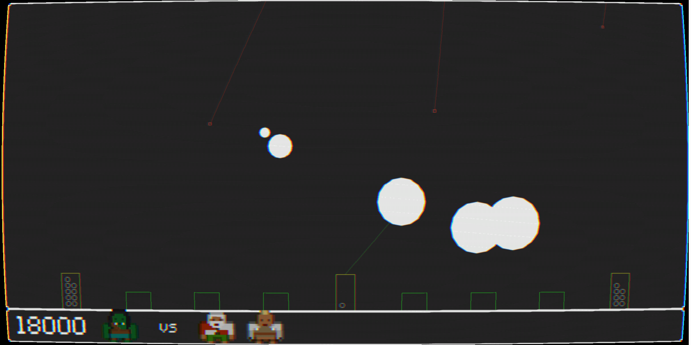
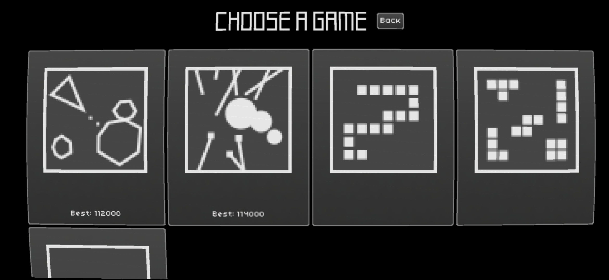

<div align="center">


[
](https://github.com/retrowars/retrowars/blob/master/LICENSE) [
](https://liberapay.com/retrowars/donate) [
](https://f-droid.org/packages/com.serwylo.retrowars/) [
](https://hosted.weblate.org/projects/retrowars/) [
](https://github.com/retrowars/retrowars)

[](https://f-droid.org/packages/com.serwylo.retrowars/) [
](https://play.google.com/store/apps/details?id=com.serwylo.retrowars)

</div>

Enjoy retro games? Enjoy multiplayer games? Ever wanted to play one retro game against a different game in real time?

**Welcome to Super Retro Mega Wars!**

Play against your friends, with each of you can competing by playing a different game. Score points in your game and every other game will be handicapped in their own unique way. But watch out, as others score, your game will become more difficult too.

Six different single and multi-player versions of games based on classic retro titles, with more in the pipeline!

No ads. No in game purchases. Just retro games and good times.

Any feedback is very welcome at <a href="https://github.com/retrowars/retrowars/issues">GitHub</a>.

**Known limitations:**

* Thorough play testing required to balance the games.
* Untested on multiple screen sizes.

# Screenshots

   

# Contributing

## Donations

Super Retro Mega Wars is an open source, GPLv3 game. It will always be freely available via F-Droid, or for anyone to build, fork, or improve via the source code.

If you wish to support the development financially, donations are welcome via:

* [Liberapay](https://liberapay.com/retrowars/donate)
* [GitHub sponsors](https://github.com/sponsors/pserwylo)

## Reporting Issues

Please report any issues or suggest features on the [issue tracker](https://github.com/retrowars/retrowars/issues).

## Translating

We use [Weblate](https://hosted.weblate.org/engage/retrowars/) to manage translations. Please see [these instructions for using Weblate](https://hosted.weblate.org/engage/retrowars/) to translate BabyDots.

|Game strings|F-Droid metadata|
|------------|----------------|
|[](https://hosted.weblate.org/engage/retrowars/)|[](https://hosted.weblate.org/engage/retrowars/)|

## Submitting changes

Pull requests will be warmly received at [https://github.com/retrowars/retrowars](https://github.com/retrowars/retrowars), although it is often easier to first discuss your ideas via the [issue tracker](https://github.com/retrowars/retrowars/issues).

## Running a public server

If you are able to run a public server, please [see the retrowars-server](https://github.com/retrowars/retrowars-servers/#contributing) project for more details.
Doing so will make it appear in the default retro wars client when searching for public servers, and ensure that people can continue to play against eachother even if the official servers are down.

### Running a server on Heroku

Before pushing to your Heroku app, make sure to set the following config:

```
heroku config:set GRADLE_TASK="-PexcludeAndroid stage"
```

Explanation: Newer versions of the Android Gradle plugin require an Android SDK to even configure the `:android` subproject of a libgdx project, not just to compile it.
To [avoid this issue, run the command above](https://devcenter.heroku.com/articles/deploying-gradle-apps-on-heroku#multiple-application-types-in-the-same-project) to tell Heroku that it doesn't need to worry about configuring anything except the `:core` and `:server` projects, and therefore it doesn't matter that the Android SDK is missing.

# Compiling

This app uses a the libgdx library and Kotlin. It is recommended to read the [libgdx documentation to get a dev environment setup](https://libgdx.com/dev/setup/).

Alternatively, you can import the project into Android Studio and build from there.
