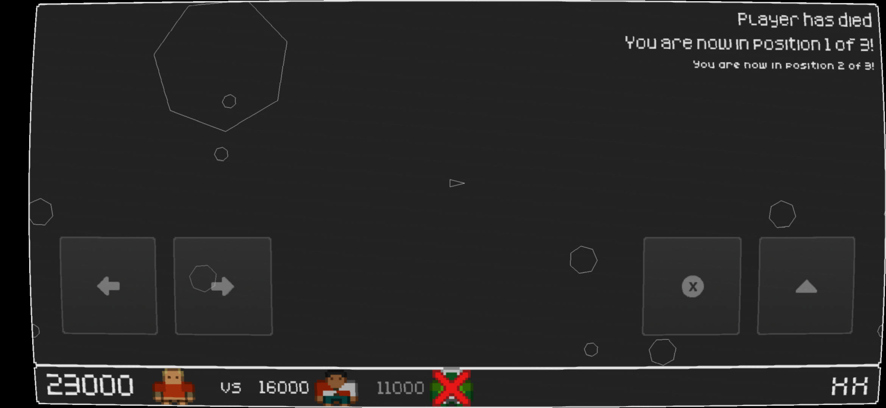
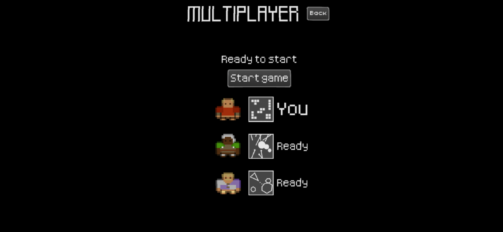
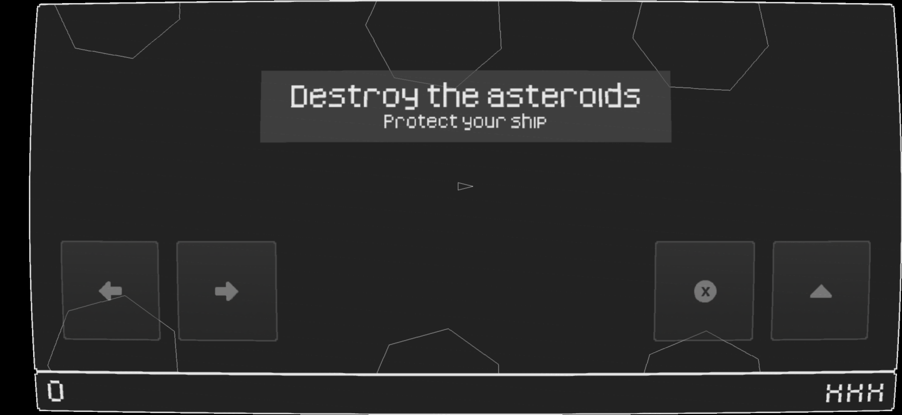
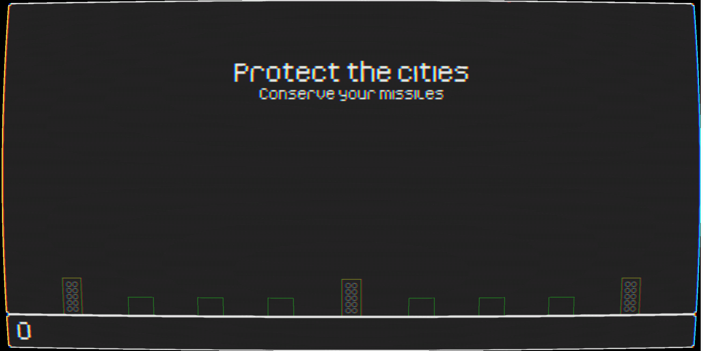

# Super Retro Mega Wars

   

Enjoy retro games? Enjoy multiplayer games? Ever wanted to play one retro game against a different game in real time?

**Welcome to Super Retro Mega Wars!**

Play against your friends, with each of you can competing by playing a different game. Score points in your game and every other game will be handicaped in their own unique way. But watch out, as others score, your game will become more difficult too.

Still in early stage development (networking is quite buggy), but currently supports four different single and multi-player versions of games based on classic retro titles.

No ads. No in game purchases. Just retro games and good times.

Any feedback is very welcome at <a href="https://github.com/retrowars/retrowars/issues">GitHub</a>.

**Known limitations:**

* Networking is quite buggy.
* Only local network play supported.
* Thorough play testing required to balance the games.
* Untested on multiple screen sizes.

## Contributing

### Donations

Super Retro Mega Wars is an open source, GPLv3 game. It will always be freely available via F-Droid, or for anyone to build, fork, or improve via the source code.

If you wish to support the development financially, donations are welcome via:

* [Liberapay](https://liberapay.com/retrowars/donate)
* [GitHub sponsors](https://github.com/sponsors/pserwylo)

### Reporting Issues

Please report any issues or suggest features on the [issue tracker](https://github.com/retrowars/retrowars/issues).

### Submitting changes

Pull requests will be warmly received at [https://github.com/retrowars/retrowars](https://github.com/retrowars/retrowars).

### Running a public server

If you are able to run a public server, please submit an issue and we can add your server to the list of well known servers.
Doing so will make it appear in the default retro wars client when searching for public servers.

## Compiling

This app uses a the libgdx library and Kotlin. It is recommended to read the [libgdx documentation to get a dev environment setup](https://libgdx.com/dev/setup/).

Alternatively, you can import the project into Android Studio and build from there.
